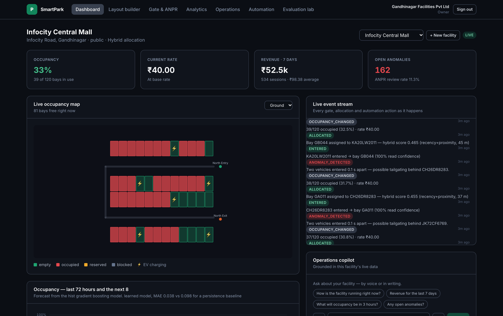
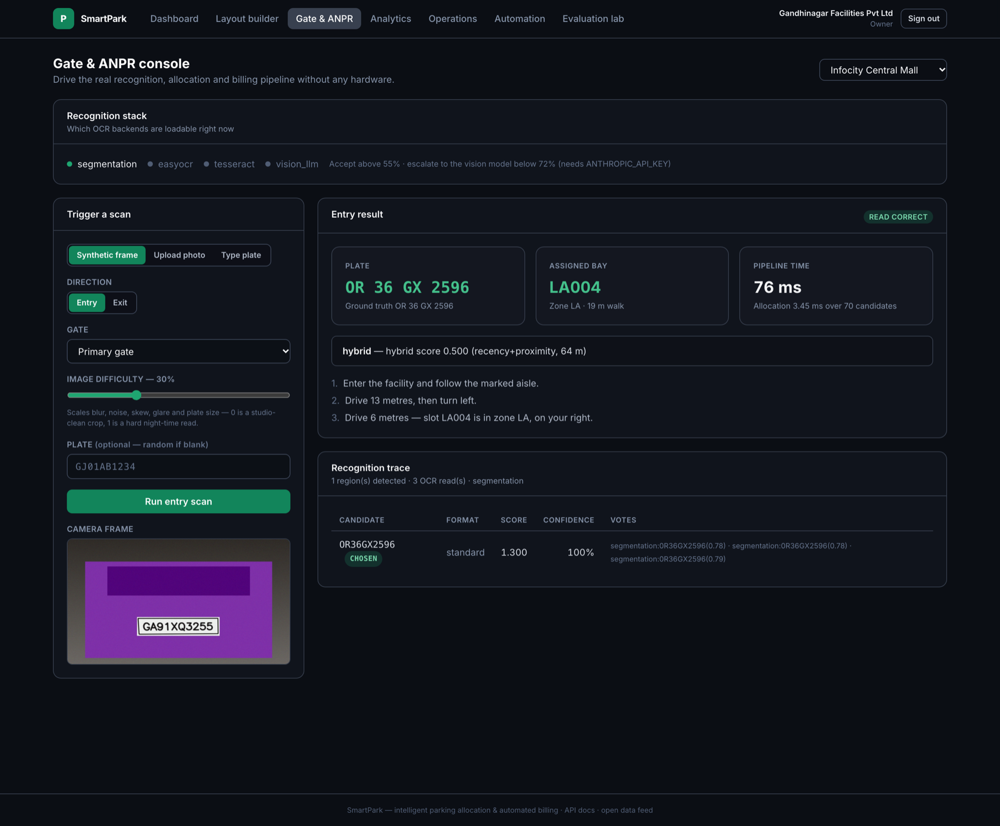
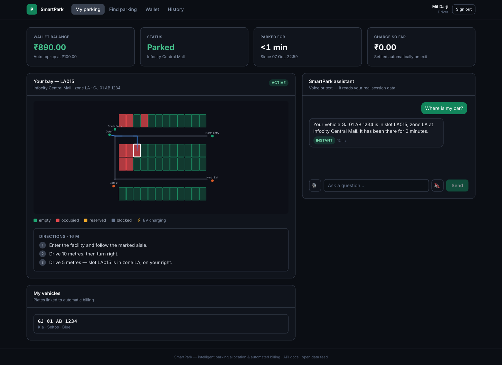
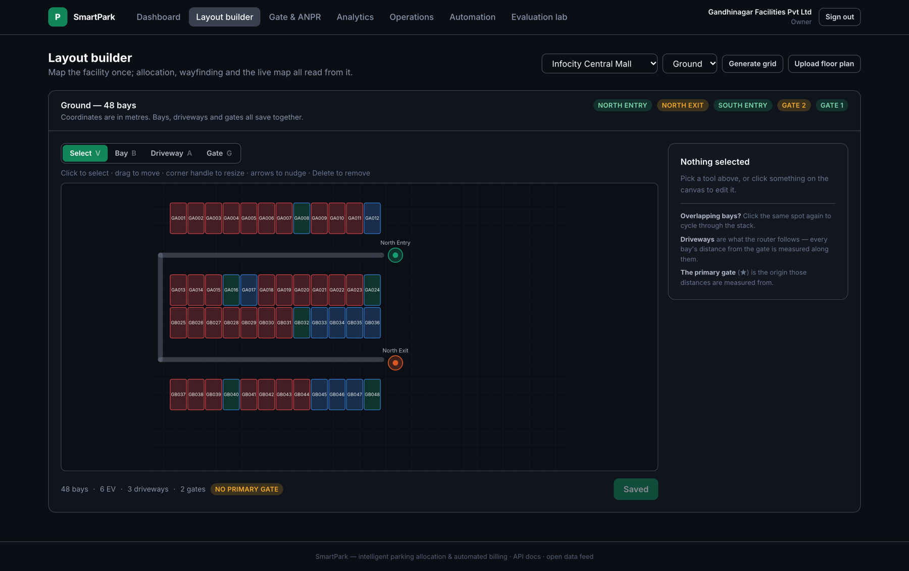
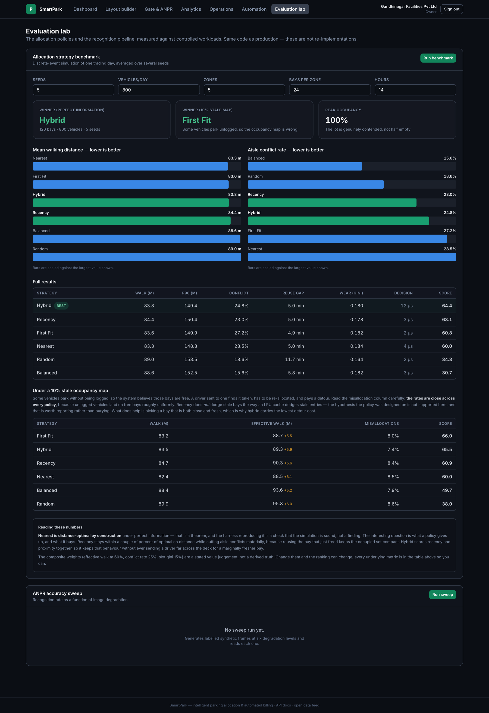
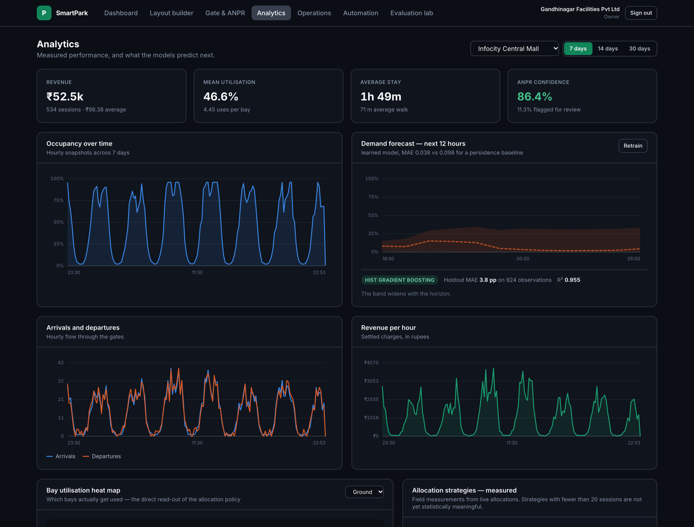
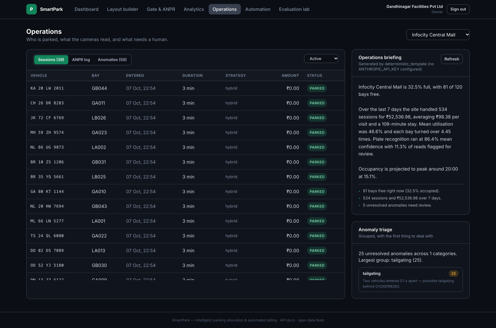

# SmartPark

**Intelligent parking allocation and automated billing.**

A camera reads the number plate at the gate. An allocation policy picks the bay
and the driver is guided straight to it. On the way out the same read closes the
session, prices the stay against live occupancy, and settles it from a wallet —
no ticket, no attendant, no cash.

Built end to end: computer vision, an allocation policy with a real evaluation
harness, a billing engine, demand forecasting, anomaly detection, a rules engine,
a voice assistant, an operations copilot, and a public open-data feed.



> ### Status: what is and is not proven
>
> **The image pipeline is real and complete.** A JPEG posted to `/gates/entry` is
> decoded, localised, deskewed, read by the OCR ensemble, allocated a bay and
> billed — no stubs anywhere in that path.
>
> **It has not been validated on real-world photographs.** Every accuracy figure
> below was measured on frames SmartPark renders itself. With only the built-in
> reader installed, a plate drawn in a font it has not seen scores **0 out of 5**,
> because that reader matches glyphs against templates in the *same font family*
> the generator draws with. On real camera imagery it should be assumed not to work.
>
> Reading genuine photographs needs one of the backends built for it — `easyocr`
> (`pip install -r backend/requirements-ai.txt`) or `ANTHROPIC_API_KEY` for the
> Claude vision escalation. Both are supported; neither is installed by default,
> and nothing in this repository has yet been tested against a photograph of a
> real number plate.

---

## Quick start

Everything below runs with no API keys and no cloud account.

```bash
git clone <this-repo> && cd SmartPark
cp .env.example .env
make setup      # python venv + npm install
make seed       # two facilities, 21 days of history, trained models
make backend    # http://localhost:8000  (API docs at /docs)
make frontend   # http://localhost:5173
```

> **Your data persists.** Accounts and facilities you create live in
> `backend/data/smartpark.db` (or the `pgdata` volume under Docker) and survive
> restarts. `make seed` is *destructive* — it now refuses to run when the
> database holds accounts it did not create, and `make backup` snapshots the
> file first.

Sign in with any of the seeded accounts (password `SmartPark2026!`):

| Account | Email | What you get |
|---|---|---|
| Operator | `owner@smartpark.dev` | Dashboard, layout builder, ANPR console, analytics, automation, evaluation lab |
| Driver | `mit.darji@smartpark.dev` | Live session, route to the bay, wallet, voice assistant |
| Admin | `admin@smartpark.dev` | Everything, plus cross-tenant reconciliation |

> **Port already in use?** The backend takes `--port`, and the frontend reads
> `VITE_API_TARGET` and `PORT`:
> `VITE_API_TARGET=http://127.0.0.1:8021 PORT=5199 npm run dev`

### The 60-second tour

1. Sign in as the **operator** → the dashboard shows a live occupancy map and an
   event stream over a WebSocket.
2. Go to **Gate & ANPR** → press *Run entry scan*. A synthetic camera frame is
   generated, pushed through the real detection + OCR pipeline, allocated a bay,
   and routed. Watch the dashboard update in the same instant.
3. Go to **Evaluation lab** → *Run benchmark*. Six allocation policies over two
   information regimes, with the numbers and the caveats.
4. Sign in as the **driver** → your bay is highlighted, the route is drawn, and
   the assistant answers "where is my car?" from real data in about 5 ms.

---

## What it looks like

### Gate &amp; ANPR console
Drive the real recognition, allocation and billing pipeline with no hardware
attached. A synthetic camera frame goes through detection, the OCR ensemble and
the allocator, and the response shows the full inference trace — every backend's
proposal, how consensus was reached, and why that bay was chosen.



### Driver view
The bay is highlighted, the route is drawn along the facility's own driveway
graph, and the charge accrues live. The assistant answers from real session data —
"Where is my car?" resolves in about 12 ms without a model call, because a regex
intent router maps it straight to a tool.



### Layout builder
Four tools — select, bay, driveway, gate. Coordinates are metres, and the
driveways are not decoration: the wayfinder routes along them, and every bay's
stored distance from the primary gate is measured through that graph.



### Evaluation lab
Six allocation policies measured over two information regimes, with the weighting
stated and every underlying metric published so the ranking can be argued with.
The notes explain where the proposed policy wins, and where its own founding
hypothesis did not survive the data.



### Analytics
KPIs, occupancy history, demand forecast with a widening uncertainty band, a
per-bay utilisation heat map, and measured allocation performance on real traffic.



### Operations
Who is parked, what the cameras read and at what confidence, what needs a human,
and a generated operations briefing grounded on a facts block.



---

## What is in here

| Area | Implementation |
|---|---|
| **Computer vision** | OpenCV plate localisation (blackhat → Sobel → morphology → contour scoring), perspective deskew, five preprocessing variants, glyph segmentation with template correlation, and a weighted-vote OCR ensemble. Optional EasyOCR and Tesseract backends; Claude vision as an escalation path for weak reads. |
| **AI / ML** | Gradient-boosted occupancy forecasting with a chronological holdout and a persistence baseline it has to beat; dwell-time prediction; IsolationForest anomaly detection over session features, paired with explicit rules. |
| **Generative AI** | Operations briefings, bill explanations, anomaly triage and automation-rule drafting — every one grounded on a facts block, with a deterministic template fallback when no API key is set. |
| **Voice AI & agents** | A tool-calling agent with role-scoped tools and a confirmation gate on anything that moves money. A regex intent router answers the common questions in ~5 ms without a model call. Browser Web Speech in, Web Speech out; on-device Whisper for kiosks. |
| **Smart city** | A public, unauthenticated availability feed in JSON and GeoJSON with no personal data, a discovery manifest, and modelled sustainability metrics that state their own assumptions. |
| **Backend** | FastAPI + SQLAlchemy 2 (async), 91 routes, domain-typed errors, structured JSON logging with correlation IDs, WebSocket fan-out, an in-process event bus. |
| **Frontend** | React 18 + TypeScript + Vite + Tailwind. A canvas layout builder, a live SVG occupancy map with animated routing, and hand-built charts on a CVD-validated palette. No chart library. |
| **APIs & integrations** | Payment gateway adapters (mock / Razorpay / Stripe) behind one interface, Twilio SMS, SMTP email, OpenWeather — each degrading cleanly when unconfigured. |
| **Data** | SQLite by default, Postgres by changing one URL. WAL and enforced foreign keys, an append-only wallet ledger with idempotency keys, and a reconciliation check that recomputes every balance from its transactions. |
| **Cloud** | Dockerfile + compose (Postgres, Redis, nginx), GitHub Actions CI, a deep `/health` endpoint that reports every subsystem separately. |
| **Automation** | A declarative trigger/condition/action rules engine, evaluated on both event-bus topics and a scheduler. Rules are rows, so a new one takes effect with no deploy — and the AI copilot can draft one safely because unknown actions are rejected, not executed. |

---

## Architecture

```
                    ┌──────────────── React + Vite (TypeScript) ───────────────┐
                    │  driver app · operator console · layout builder · lab    │
                    └───────────────┬──────────────────────┬───────────────────┘
                            REST / JSON              WebSocket
                                    │                      │
┌───────────────────────────────────▼──────────────────────▼───────────────────┐
│                              FastAPI application                             │
│                                                                              │
│   /gates ──► ParkingService ──► ANPR ──► Allocation ──► Pricing ──► Wallet    │
│                    │                                                         │
│                    └──► EventBus ──┬──► WebSocket fan-out                     │
│                                    ├──► Automation rules engine               │
│                                    └──► Analytics recorder                    │
│                                                                              │
│   ANPR       detect → deskew → 5 preprocessings × N backends → vote → decide  │
│   Allocation nearest │ recency │ random │ first-fit │ balanced │ hybrid       │
│   ML         occupancy forecaster · dwell predictor · anomaly detector        │
│   GenAI      Claude — briefings, explanations, rule drafting, vision fallback │
│   Agents     tool-calling runtime, role-scoped, confirmation-gated            │
└───────────────────────────────────┬──────────────────────────────────────────┘
                                    │
                    SQLAlchemy 2 (async) → SQLite / PostgreSQL
```

Full detail in [docs/ARCHITECTURE.md](docs/ARCHITECTURE.md).

---

## Results

Measured, not asserted. The harness runs the same policy functions the
production allocator calls, so the numbers describe shipped code.

**Allocation** — 120 bays, 800 vehicles/day, 6 seeds, peak occupancy 100%:

| Strategy | Walk (m) | Conflict rate | Composite |
|---|---:|---:|---:|
| **hybrid** *(default)* | 83.8 | 24.8% | **65.5** |
| **recency** *(the proposed policy)* | 84.4 | 23.0% | 64.8 |
| first-fit | 83.6 | 27.2% | 61.2 |
| nearest *(baseline)* | **83.3** | 28.5% | 60.0 |
| random | 89.0 | 18.6% | 38.3 |
| balanced | 89.1 | 17.1% | 34.1 |

`nearest` is distance-optimal by construction — that is a theorem, and the
harness reproducing it is a soundness check, not a finding. The recency policy
lands **within 1.3% of optimal distance while cutting aisle conflicts by 19%**,
and `hybrid` gets most of both. One hypothesis behind the recency policy did
**not** survive contact with the data; that is written up honestly in
[docs/EVALUATION.md](docs/EVALUATION.md).

**Recognition** — 25 labelled synthetic frames per difficulty level, CPU only:

| Difficulty | 0.00 | 0.15 | 0.30 | 0.45 | 0.60 | 0.75 |
|---|---:|---:|---:|---:|---:|---:|
| Exact match | 92% | 96% | 96% | 76% | 96% | 92% |
| Latency | 36 ms | 35 ms | 35 ms | 35 ms | 38 ms | 39 ms |

**Read that table as a pipeline test, not an accuracy claim.** It shows the
detector, deskew, preprocessing fan-out and voting ensemble working under
controlled degradation — blur, noise, skew, glare. It does not show that the
system can read a real plate.

The same pipeline, given plates rendered in Arial instead of the generator's
Hershey font:

| Font | Correct |
|---|---:|
| Hershey — what the generator draws with | **5 / 5** |
| Arial — a font the reader has never seen | **0 / 5** |

That is the honest measure of the built-in reader: it matches glyph bitmaps
against templates drawn in one font family, so it generalises to nothing else.
It exists so the platform has no hard dependency on a heavy runtime and stays
demonstrable offline — not because it is fit for a gate camera.

Real-world reading is the job of `easyocr` (a CRNN trained on photographs) or the
Claude vision escalation. Both are wired in and selected by the same ensemble;
install or configure either and this number changes. Until then, the gate console
and the tests exercise the pipeline, not the recognition.

**Forecasting** — holdout MAE 4.3 percentage points against a persistence
baseline of 10.1 pp, on 480 hourly observations. The API reports both, so a model
that fails to beat its baseline says so.

Reproduce any of it:

```bash
make bench                                    # allocation, both regimes
cd backend && .venv/bin/python -m scripts.benchmark --all --json results.json
```

---

## Tests

```bash
make test        # 125 tests, ~4 seconds
```

They cover the parts where being wrong is expensive: plate repair and fuzzy
matching, every allocation policy including the eligibility rules, pricing bounds
and the daily cap, wallet atomicity under a stale read, the OCR ensemble's
context prior, layout geometry, access control across roles, and the full
entry-to-exit lifecycle over HTTP.

---

## Deployment

```bash
make docker                                   # api + postgres + redis + nginx
docker compose exec api python -m scripts.seed --reset --train
open http://localhost:8080
```

The Dockerfile is a multi-stage build (frontend → static, backend → slim runtime)
running as a non-root user with a health check. Compose wires in Postgres and
Redis; the application code does not change — only `DATABASE_URL`.

Verified end to end on the compose stack: all four containers healthy, the SPA
and its deep links served through nginx, WebSocket upgrades proxied correctly,
and a full entry→exit lifecycle against PostgreSQL.

In the container the SPA is served at `/` and the JSON service banner moves to
`/api`; nginx fronts everything on **:8080** and the API is also exposed directly
on **:8000**.

---

## Configuration

Everything in `.env.example`. Nothing is required to run: with no keys, the
platform reports which subsystems are degraded on `/health` and in the UI, and
falls back to deterministic local engines rather than failing.

| Variable | Effect when absent |
|---|---|
| `ANTHROPIC_API_KEY` | Briefings and explanations come from templates; the agent uses a keyword router; the vision OCR backend is skipped |
| `RAZORPAY_*` / `STRIPE_*` | The mock payment gateway is used |
| `TWILIO_*` / `SMTP_*` | Notifications are stored in-app only |
| `OPENWEATHER_API_KEY` | A seasonal estimate feeds the forecaster |
| Optional AI extras | `pip install -r backend/requirements-ai.txt` adds EasyOCR, Tesseract, Whisper and offline TTS |

---

## Project context

Built against the *Vehicle Number Plate Recognition System for Parking
Management* problem statement — B.Tech ICT, Pandit Deendayal Energy University.
The scope's three phases (core loop, differentiators, floor-plan detection) are
all implemented; see [docs/EVALUATION.md](docs/EVALUATION.md) for what the
evaluation actually showed, including where it disagreed with the design's own
assumptions.
